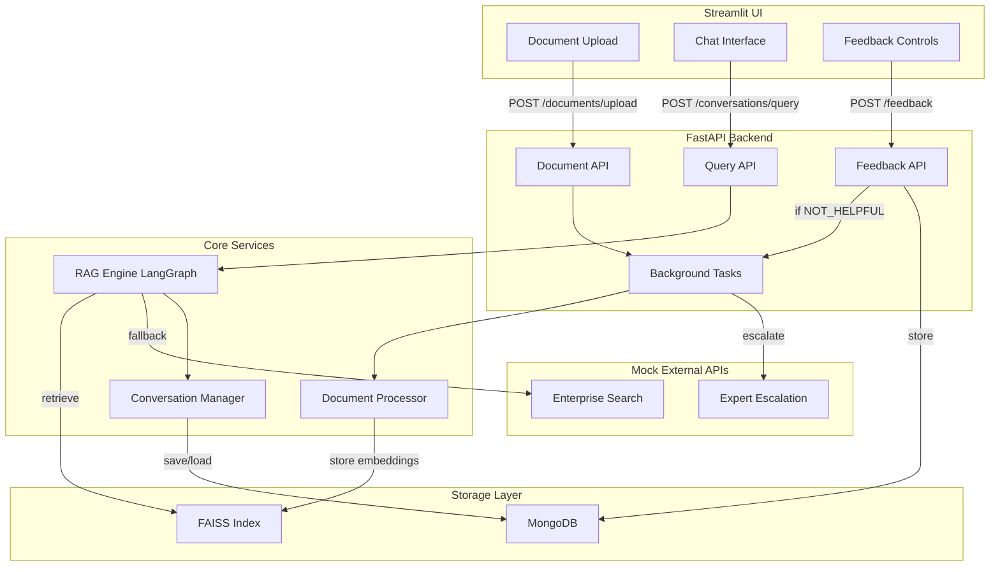
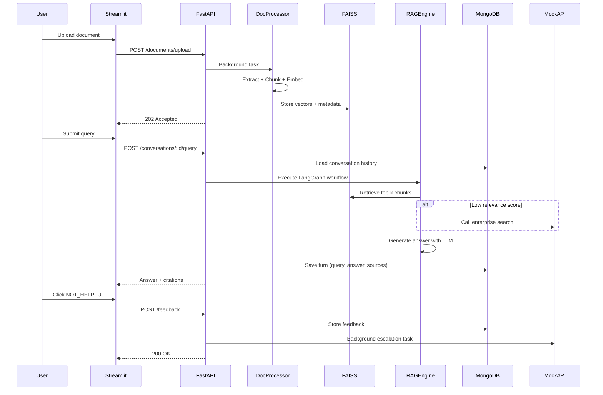

# RAG PoC Implementation Plan

## High-Level Architecture



## Component Responsibilities

### Streamlit UI (`ui/streamlit_app.py`)

- File upload interface for PDF, DOCX, MD
- Chat interface with conversation thread display
- Feedback buttons (thumbs up/down) for each response
- Display source citations

### FastAPI Backend (`backend/app/main.py`)

- REST API endpoints for upload, query, feedback
- Background task orchestration via `BackgroundTasks`
- CORS middleware for Streamlit integration

### Document Processor (`backend/app/services/document_processor.py`)

- Extract text from PDF, DOCX, MD
- Chunk text using `RecursiveCharacterTextSplitter`
- Generate embeddings via OpenAI
- Store in FAISS with metadata (filename, chunk_id, page)

### RAG Engine (`backend/app/services/rag_engine.py`)

- LangGraph workflow: RETRIEVE → RERANK → GENERATE → CITE
- FAISS similarity search (top-k chunks)
- Fallback to mock enterprise search if scores < threshold
- Return answer + source citations

### Conversation Manager (`backend/app/services/conversation_manager.py`)

- Create/load conversation threads from MongoDB
- Append query/response turns
- Provide conversation history for context-aware RAG

### Mock External APIs (`backend/app/services/external_mock.py`)

- Simulate enterprise search API (returns dummy results)
- Simulate expert escalation webhook (logs to console)

## Data Flow



## Minimal Project Structure

```
rag-poc/
├── backend/
│   ├── app/
│   │   ├── __init__.py
│   │   ├── main.py                    # FastAPI app + routes
│   │   ├── config.py                  # Environment variables
│   │   ├── models.py                  # Pydantic schemas
│   │   └── services/
│   │       ├── __init__.py
│   │       ├── document_processor.py  # Extract, chunk, embed
│   │       ├── rag_engine.py          # LangGraph RAG workflow
│   │       ├── conversation_manager.py # MongoDB CRUD
│   │       └── external_mock.py       # Mock APIs
│   ├── faiss_index/                   # FAISS persistence directory
│   ├── uploads/                       # Temporary file storage
│   └── requirements.txt
├── ui/
│   ├── streamlit_app.py              # Streamlit frontend
│   └── requirements.txt
├── evaluation/
│   ├── ragas_eval.py                 # RAGAS evaluation script
│   └── test_queries.json             # Sample Q&A pairs
└── .env.example                      # API keys template
```

## Detailed Implementation Plan

### Phase 1: Project Scaffolding

**Goal**: Set up project structure, dependencies, and configuration.

**Files to create**:

- `backend/requirements.txt`
- `backend/app/__init__.py`
- `backend/app/config.py`
- `backend/app/models.py`
- `ui/requirements.txt`
- `.env.example`

**Backend dependencies** (`backend/requirements.txt`):

```txt
fastapi==0.109.0
uvicorn[standard]==0.27.0
python-multipart==0.0.6
langchain==0.1.0
langgraph==0.0.20
openai==1.10.0
faiss-cpu==1.7.4
pymongo==4.6.1
pypdf2==3.0.1
python-docx==1.1.0
pydantic==2.5.3
pydantic-settings==2.1.0
```

**UI dependencies** (`ui/requirements.txt`):

```txt
streamlit==1.30.0
requests==2.31.0
```

**Config setup** (`backend/app/config.py`):

```python
from pydantic_settings import BaseSettings

class Settings(BaseSettings):
    openai_api_key: str
    mongodb_uri: str = "mongodb://localhost:27017"
    mongodb_db: str = "rag_poc"
    faiss_index_path: str = "./faiss_index"
    upload_dir: str = "./uploads"
    
    class Config:
        env_file = ".env"
```

**Pydantic models** (`backend/app/models.py`):

```python
from pydantic import BaseModel
from typing import List, Optional
from datetime import datetime

class DocumentUploadResponse(BaseModel):
    document_id: str
    status: str
    
class QueryRequest(BaseModel):
    query: str
    conversation_id: Optional[str] = None
    
class SourceCitation(BaseModel):
    document: str
    chunk_id: str
    content: str
    score: float
    
class QueryResponse(BaseModel):
    answer: str
    sources: List[SourceCitation]
    conversation_id: str
    
class FeedbackRequest(BaseModel):
    conversation_id: str
    turn_index: int
    feedback_type: str  # "HELPFUL" or "NOT_HELPFUL"
```

---

### Phase 2: Document Ingestion

**Goal**: Upload documents, extract text, and store temporarily.

**File**: `backend/app/services/document_processor.py`

**Key functions**:

```python
def extract_text_from_pdf(file_path: str) -> str:
    # Use PyPDF2.PdfReader
    
def extract_text_from_docx(file_path: str) -> str:
    # Use python-docx
    
def extract_text_from_md(file_path: str) -> str:
    # Read as plain text
    
def chunk_text(text: str, chunk_size: int = 1000, chunk_overlap: int = 200) -> List[str]:
    # Use LangChain's RecursiveCharacterTextSplitter
```

**API endpoint** (`backend/app/main.py`):

```python
@app.post("/documents/upload", response_model=DocumentUploadResponse)
async def upload_document(
    file: UploadFile,
    background_tasks: BackgroundTasks
):
    # Save file to uploads/
    # Add background task to process document
    # Return document_id and "processing" status
```

---

### Phase 3: FAISS-based Embedding + Retrieval

**Goal**: Generate embeddings, build FAISS index, and enable similarity search.

**Update**: `backend/app/services/document_processor.py`

**Key functions**:

```python
from langchain.embeddings import OpenAIEmbeddings
from langchain.vectorstores import FAISS
from langchain.docstore.document import Document

def generate_embeddings_and_index(
    chunks: List[str],
    metadata: List[dict],
    index_path: str
):
    embeddings = OpenAIEmbeddings()
    documents = [
        Document(page_content=chunk, metadata=meta)
        for chunk, meta in zip(chunks, metadata)
    ]
    
    # Load existing or create new
    if os.path.exists(f"{index_path}/index.faiss"):
        vectorstore = FAISS.load_local(index_path, embeddings)
        vectorstore.add_documents(documents)
    else:
        vectorstore = FAISS.from_documents(documents, embeddings)
    
    vectorstore.save_local(index_path)
```

**Helper to load FAISS**:

```python
def load_faiss_index(index_path: str):
    embeddings = OpenAIEmbeddings()
    return FAISS.load_local(index_path, embeddings)
```

---

### Phase 4: LangGraph RAG Workflow

**Goal**: Define a LangGraph workflow for retrieval, optional reranking, generation, and citation.

**File**: `backend/app/services/rag_engine.py`

**LangGraph structure**:

```python
from langgraph.graph import StateGraph, END
from typing import TypedDict, List

class RAGState(TypedDict):
    query: str
    conversation_history: List[dict]
    retrieved_chunks: List[dict]
    answer: str
    sources: List[dict]

def retrieve_node(state: RAGState) -> RAGState:
    # Load FAISS, search top-k
    # If max score < 0.7, call mock enterprise search
    # Update state["retrieved_chunks"]
    return state

def generate_node(state: RAGState) -> RAGState:
    # Build prompt with conversation_history + retrieved_chunks
    # Call OpenAI ChatCompletion
    # Update state["answer"]
    return state

def cite_node(state: RAGState) -> RAGState:
    # Format source citations from retrieved_chunks
    # Update state["sources"]
    return state

def build_rag_graph():
    graph = StateGraph(RAGState)
    graph.add_node("retrieve", retrieve_node)
    graph.add_node("generate", generate_node)
    graph.add_node("cite", cite_node)
    
    graph.set_entry_point("retrieve")
    graph.add_edge("retrieve", "generate")
    graph.add_edge("generate", "cite")
    graph.add_edge("cite", END)
    
    return graph.compile()
```

**Execute workflow**:

```python
async def run_rag_query(query: str, conversation_id: Optional[str] = None):
    # Load conversation history if conversation_id exists
    # Initialize state
    # Execute graph
    # Return answer + sources
```

---

### Phase 5: Query + Conversation Thread API

**Goal**: Create conversation threads, execute RAG queries, store turns in MongoDB.

**File**: `backend/app/services/conversation_manager.py`

**MongoDB schema**:

```json
{
  "_id": "conv_abc123",
  "created_at": "2025-12-11T10:00:00Z",
  "turns": [
    {
      "query": "What is RAG?",
      "answer": "Retrieval-Augmented Generation...",
      "sources": [...],
      "timestamp": "2025-12-11T10:00:05Z"
    }
  ]
}
```

**Key functions**:

```python
from pymongo import MongoClient
from datetime import datetime
import uuid

def create_conversation() -> str:
    client = MongoClient(settings.mongodb_uri)
    db = client[settings.mongodb_db]
    conv_id = f"conv_{uuid.uuid4().hex[:12]}"
    db.conversations.insert_one({
        "_id": conv_id,
        "created_at": datetime.utcnow(),
        "turns": []
    })
    return conv_id

def load_conversation(conv_id: str) -> dict:
    # Fetch from MongoDB
    
def append_turn(conv_id: str, query: str, answer: str, sources: List[dict]):
    # Append to turns array in MongoDB
```

**API endpoint** (`backend/app/main.py`):

```python
@app.post("/conversations/query", response_model=QueryResponse)
async def query_rag(request: QueryRequest):
    # Create or load conversation
    # Run RAG workflow
    # Append turn to MongoDB
    # Return response
```

---

### Phase 6: Feedback API + Escalation Mock

**Goal**: Accept feedback, store in MongoDB, trigger mock escalation for NOT_HELPFUL.

**File**: `backend/app/services/external_mock.py`

**Mock functions**:

```python
import time

def mock_enterprise_search(query: str) -> List[dict]:
    time.sleep(0.5)  # Simulate network delay
    return [
        {"source": "external_system", "content": "Mock result 1", "score": 0.6},
        {"source": "external_system", "content": "Mock result 2", "score": 0.5}
    ]

def mock_expert_escalation(query: str, answer: str, feedback: str):
    print(f"[ESCALATION] Query: {query}")
    print(f"[ESCALATION] Answer: {answer}")
    print(f"[ESCALATION] Feedback: {feedback}")
    # In real system, would POST to external API
```

**Feedback storage** (update `conversation_manager.py`):

```python
def store_feedback(conv_id: str, turn_index: int, feedback_type: str):
    db.conversations.update_one(
        {"_id": conv_id},
        {"$set": {f"turns.{turn_index}.feedback": feedback_type}}
    )
```

**API endpoint** (`backend/app/main.py`):

```python
@app.post("/feedback")
async def submit_feedback(
    request: FeedbackRequest,
    background_tasks: BackgroundTasks
):
    # Store feedback in MongoDB
    store_feedback(request.conversation_id, request.turn_index, request.feedback_type)
    
    # If NOT_HELPFUL, trigger escalation
    if request.feedback_type == "NOT_HELPFUL":
        # Load turn data
        conv = load_conversation(request.conversation_id)
        turn = conv["turns"][request.turn_index]
        background_tasks.add_task(
            mock_expert_escalation,
            turn["query"],
            turn["answer"],
            "NOT_HELPFUL"
        )
    
    return {"status": "feedback_recorded"}
```

---

### Phase 7: Streamlit UI

**Goal**: Simple UI for document upload, chat, and feedback.

**File**: `ui/streamlit_app.py`

**Layout**:

```python
import streamlit as st
import requests

BACKEND_URL = "http://localhost:8000"

st.title("RAG PoC - Document Q&A")

# Sidebar: Document Upload
with st.sidebar:
    st.header("Upload Documents")
    uploaded_file = st.file_uploader("Choose PDF, DOCX, or MD", type=["pdf", "docx", "md"])
    if uploaded_file and st.button("Upload"):
        files = {"file": uploaded_file}
        response = requests.post(f"{BACKEND_URL}/documents/upload", files=files)
        st.success(f"Uploaded: {response.json()['document_id']}")

# Main: Chat Interface
if "conversation_id" not in st.session_state:
    st.session_state.conversation_id = None
if "messages" not in st.session_state:
    st.session_state.messages = []

# Display chat history
for idx, msg in enumerate(st.session_state.messages):
    with st.chat_message(msg["role"]):
        st.write(msg["content"])
        if msg["role"] == "assistant":
            # Show sources
            with st.expander("Sources"):
                for src in msg.get("sources", []):
                    st.write(f"**{src['document']}** (score: {src['score']:.2f})")
                    st.write(src["content"])
            
            # Feedback buttons
            col1, col2 = st.columns(2)
            with col1:
                if st.button("👍 Helpful", key=f"helpful_{idx}"):
                    feedback_response = requests.post(
                        f"{BACKEND_URL}/feedback",
                        json={
                            "conversation_id": st.session_state.conversation_id,
                            "turn_index": idx // 2,  # Each turn has user + assistant
                            "feedback_type": "HELPFUL"
                        }
                    )
                    st.success("Feedback recorded!")
            with col2:
                if st.button("👎 Not Helpful", key=f"not_helpful_{idx}"):
                    feedback_response = requests.post(
                        f"{BACKEND_URL}/feedback",
                        json={
                            "conversation_id": st.session_state.conversation_id,
                            "turn_index": idx // 2,
                            "feedback_type": "NOT_HELPFUL"
                        }
                    )
                    st.warning("Feedback recorded. Escalating to expert.")

# Query input
if query := st.chat_input("Ask a question about your documents"):
    st.session_state.messages.append({"role": "user", "content": query})
    
    # Call backend
    response = requests.post(
        f"{BACKEND_URL}/conversations/query",
        json={
            "query": query,
            "conversation_id": st.session_state.conversation_id
        }
    )
    result = response.json()
    
    # Update conversation_id
    st.session_state.conversation_id = result["conversation_id"]
    
    # Add assistant response
    st.session_state.messages.append({
        "role": "assistant",
        "content": result["answer"],
        "sources": result["sources"]
    })
    
    st.rerun()
```

---

### Phase 8: Testing + RAGAS Evaluation

**Goal**: Lightweight evaluation using RAGAS metrics.

**File**: `evaluation/ragas_eval.py`

**Setup**:

```python
from ragas import evaluate
from ragas.metrics import faithfulness, answer_relevancy, context_recall
from datasets import Dataset

# Prepare test dataset
test_data = {
    "question": ["What is RAG?", "How does FAISS work?"],
    "answer": ["...", "..."],  # From your RAG system
    "contexts": [["chunk1", "chunk2"], ["chunk3"]],  # Retrieved chunks
    "ground_truth": ["Expected answer 1", "Expected answer 2"]  # Optional
}

dataset = Dataset.from_dict(test_data)

# Evaluate
results = evaluate(
    dataset,
    metrics=[faithfulness, answer_relevancy, context_recall]
)

print(results)
```

**Test queries** (`evaluation/test_queries.json`):

```json
[
  {
    "query": "What is retrieval-augmented generation?",
    "expected_keywords": ["retrieval", "generation", "LLM"]
  },
  {
    "query": "Explain vector databases",
    "expected_keywords": ["embeddings", "similarity", "search"]
  }
]
```

**Run evaluation**:

```bash
cd evaluation
python ragas_eval.py
```

---

## Technology-Specific Instructions

### FastAPI BackgroundTasks

```python
from fastapi import BackgroundTasks

def long_running_task(doc_id: str):
    # Process document
    pass

@app.post("/endpoint")
async def endpoint(background_tasks: BackgroundTasks):
    background_tasks.add_task(long_running_task, "doc123")
    return {"status": "processing"}
```

**Limitation**: Tasks run in same process, blocking if CPU-intensive. For heavy workloads, consider separate worker script:

```python
# worker.py
while True:
    task = get_next_task_from_queue()  # Redis, file, etc.
    process_task(task)
    time.sleep(1)
```

### FAISS Setup

```python
from langchain.vectorstores import FAISS
from langchain.embeddings import OpenAIEmbeddings

embeddings = OpenAIEmbeddings()

# Create index
vectorstore = FAISS.from_documents(documents, embeddings)
vectorstore.save_local("./faiss_index")

# Load index
vectorstore = FAISS.load_local("./faiss_index", embeddings)

# Search
results = vectorstore.similarity_search_with_score(query, k=5)
```

**Note**: FAISS is in-memory after loading. For persistence, call `save_local()` after updates.

### LangGraph RAG Graph

```python
from langgraph.graph import StateGraph, END

graph = StateGraph(state_schema)
graph.add_node("node_name", node_function)
graph.set_entry_point("node_name")
graph.add_edge("node_name", "next_node")
graph.add_edge("last_node", END)

compiled_graph = graph.compile()
result = compiled_graph.invoke(initial_state)
```

### MongoDB Conversation Storage

```python
from pymongo import MongoClient

client = MongoClient("mongodb://localhost:27017")
db = client["rag_poc"]

# Create conversation
db.conversations.insert_one({
    "_id": "conv_123",
    "turns": [],
    "created_at": datetime.utcnow()
})

# Append turn
db.conversations.update_one(
    {"_id": "conv_123"},
    {"$push": {"turns": {"query": "...", "answer": "..."}}}
)

# Load conversation
conv = db.conversations.find_one({"_id": "conv_123"})
```

### Streamlit Structure

```python
import streamlit as st

# Session state for persistence
if "key" not in st.session_state:
    st.session_state.key = default_value

# Layout
st.sidebar.header("Sidebar")
st.title("Main Title")

# Chat interface
for msg in st.session_state.messages:
    with st.chat_message(msg["role"]):
        st.write(msg["content"])

if query := st.chat_input("Enter message"):
    # Handle query
    st.rerun()  # Refresh UI
```

---

## Explicit PoC Simplifications

1. **No Docker**: Run FastAPI and Streamlit directly with `uvicorn` and `streamlit run`
2. **No authentication**: Open APIs, no user management
3. **No distributed storage**: FAISS on local disk, MongoDB on localhost
4. **No advanced chunking**: Fixed chunk size (1000 chars, 200 overlap)
5. **No reranking models**: Simple top-k retrieval
6. **No streaming responses**: Return complete answers
7. **No rate limiting**: Assume low traffic
8. **Minimal error handling**: Basic try/except, no retries
9. **No logging framework**: Use print() or basic logging
10. **No CI/CD**: Manual testing
11. **Single FAISS index**: All documents in one index
12. **No multi-user support**: Shared conversation space

---

## Optional Enhancements (Post-PoC)

### Immediate Improvements

- **Dockerize**: Add `Dockerfile` and `docker-compose.yml` for easy deployment
- **Add logging**: Replace prints with structured logging (loguru, structlog)
- **Error handling**: Add proper exception handling and user-friendly error messages
- **Streaming**: Use SSE or WebSockets for real-time LLM responses
- **Conversation UI**: Add sidebar with conversation history browser

### Medium-Term Features

- **Reranking**: Add cross-encoder model to rerank retrieved chunks
- **Hybrid search**: Combine FAISS with BM25 keyword search
- **Multi-index**: Separate FAISS indices per document or collection
- **Async MongoDB**: Use motor for async database operations
- **Metadata filters**: Filter FAISS search by document type, date, etc.
- **User authentication**: Add OAuth2/JWT for multi-user support

### Advanced Features

- **Query decomposition**: Break complex queries into sub-queries
- **Self-querying**: Extract filters from natural language queries
- **Agent tools**: Give LLM access to calculator, web search, etc.
- **Fine-tuned embeddings**: Train custom embedding model on domain data
- **Production vector DB**: Migrate to Qdrant, Weaviate, or Pinecone
- **Observability**: Add tracing with LangSmith or Phoenix
- **A/B testing**: Test different chunking strategies, prompts, models
- **Active learning**: Use feedback to retrain/fine-tune models

---

## Getting Started

1. **Install MongoDB**: `brew install mongodb-community` or Docker
2. **Set environment variables**: Copy `.env.example` to `.env`, add `OPENAI_API_KEY`
3. **Install backend deps**: `cd backend && pip install -r requirements.txt`
4. **Install UI deps**: `cd ui && pip install -r requirements.txt`
5. **Start MongoDB**: `mongod --dbpath ./data/db`
6. **Start backend**: `cd backend && uvicorn app.main:app --reload`
7. **Start UI**: `cd ui && streamlit run streamlit_app.py`
8. **Upload documents**: Use sidebar in Streamlit
9. **Query**: Ask questions in chat interface
10. **Provide feedback**: Click thumbs up/down on responses