# Workflow Design

This document describes the state machine diagrams, database schemas, and workflow designs for the RAG PoC application.

## Document Ingestion Workflow

### State Machine Diagram


### Detailed Workflow Steps

1. **Upload** (`POST /documents/upload`)
   - User uploads file via Streamlit UI
   - File received by FastAPI endpoint
   - File saved to `uploads/` directory
   - Document ID generated: `doc_{uuid}`
   - Response: `{document_id, status: "processing"}`

2. **Background Processing** (FastAPI BackgroundTasks)
   - Task added to background queue
   - Processing happens asynchronously

3. **Text Extraction**
   - Detect file type (PDF, DOCX, MD)
   - Extract text using appropriate library:
     - PDF: PyPDF2
     - DOCX: python-docx
     - MD: File read

4. **Text Chunking**
   - Use RecursiveCharacterTextSplitter
   - Chunk size: 1000 characters
   - Chunk overlap: 200 characters
   - Preserve document structure

5. **Embedding Generation**
   - Generate embeddings for each chunk
   - Model: OpenAI text-embedding-ada-002
   - Dimension: 1536
   - Batch processing for efficiency

6. **FAISS Indexing**
   - Create Document objects with metadata
   - Add to FAISS index (create or append)
   - Save index to disk
   - Metadata includes: document_id, filename, chunk_id, chunk_index

7. **Completion**
   - Index persisted to `faiss_index/`
   - Document ready for retrieval

## Query Processing Workflow

### State Machine Diagram


### LangGraph Workflow


### Detailed Query Steps

1. **Query Reception** (`POST /conversations/query`)
   - Receive query and optional conversation_id
   - Create or load conversation thread

2. **Context Loading**
   - Load conversation history from MongoDB
   - Extract last 3 turns for context
   - Format as conversation string

3. **Retrieval** (Retrieve Node)
   - Load FAISS index
   - Generate query embedding
   - Similarity search with k=5
   - Calculate relevance scores
   - If max score < 0.7: Call mock external search
   - Format retrieved chunks

4. **Generation** (Generate Node)
   - Build prompt with:
     - System message
     - Conversation history
     - Retrieved context
     - User query
   - Call GPT-3.5-turbo
   - Generate answer

5. **Citation** (Cite Node)
   - Format source citations
   - Include: document, chunk_id, content preview, score
   - Limit to top 5 sources

6. **Storage**
   - Append turn to conversation
   - Store in MongoDB
   - Return response with answer and sources

## Feedback Workflow

### State Machine Diagram



```mermaid
stateDiagram-v2
    [*] --> FeedbackReceived: User clicks 👍/👎
    FeedbackReceived --> StoreFeedback: Save to MongoDB
    StoreFeedback --> CheckType: Check feedback type
    CheckType --> Complete: HELPFUL
    CheckType --> Escalate: NOT_HELPFUL
    Escalate --> MockEscalation: Background task
    MockEscalation --> Complete: Log escalation
    Complete --> [*]
```

### Detailed Feedback Steps

1. **Feedback Submission** (`POST /feedback`)
   - Receive: conversation_id, turn_index, feedback_type
   - Validate conversation and turn exist

2. **Storage**
   - Update MongoDB document
   - Set `turns[turn_index].feedback = feedback_type`

3. **Escalation** (if NOT_HELPFUL)
   - Load turn data
   - Trigger background task
   - Call `mock_expert_escalation()`
   - Log escalation details

## Database Schema

### MongoDB Collections

#### `conversations` Collection

**Document Structure:**
```json
{
  "_id": "conv_abc123def456",
  "created_at": "2025-01-11T10:00:00.000Z",
  "turns": [
    {
      "query": "What is retrieval-augmented generation?",
      "answer": "Retrieval-Augmented Generation (RAG) is a technique...",
      "sources": [
        {
          "document": "rag_overview.md",
          "chunk_id": "doc_123_chunk_0",
          "content": "Retrieval-Augmented Generation (RAG) is a powerful...",
          "score": 0.85
        }
      ],
      "timestamp": "2025-01-11T10:00:05.123Z",
      "feedback": "HELPFUL"
    }
  ]
}
```

**Field Descriptions:**
- `_id` (string): Unique conversation identifier (format: `conv_{12-char-hex}`)
- `created_at` (datetime): Conversation creation timestamp
- `turns` (array): Array of conversation turns
  - `query` (string): User's question
  - `answer` (string): Generated answer
  - `sources` (array): Source citations
    - `document` (string): Source document filename
    - `chunk_id` (string): Unique chunk identifier
    - `content` (string): Chunk content preview (max 200 chars)
    - `score` (float): Relevance score (0-1)
  - `timestamp` (datetime): Turn timestamp
  - `feedback` (string, optional): "HELPFUL" or "NOT_HELPFUL"

**Indexes:**
```javascript
db.conversations.createIndex({ "_id": 1 })
db.conversations.createIndex({ "created_at": -1 })
```

### FAISS Index Structure

**Metadata Schema:**
```python
{
    "document_id": "doc_abc123",
    "filename": "rag_overview.md",
    "chunk_id": "doc_abc123_chunk_0",
    "chunk_index": 0
}
```

**Storage:**
- Vectors: `faiss_index/index.faiss` (binary)
- Metadata: `faiss_index/index.pkl` (pickle)

**Index Type:**
- IndexFlatL2 (L2 distance)
- Dimension: 1536 (OpenAI ada-002)

## Background Task Architecture

### FastAPI BackgroundTasks

**Current Implementation:**
- In-process task execution
- No external queue
- Suitable for PoC scale

**Task Types:**
1. **Document Processing**
   - Function: `process_document(file_path, document_id)`
   - Duration: 10-60 seconds
   - CPU/IO intensive

2. **Expert Escalation**
   - Function: `mock_expert_escalation(query, answer, feedback)`
   - Duration: <1 second
   - Logging only

### Production Architecture (Future)


**Components:**
- Redis: Task queue
- Celery: Distributed task processing
- Workers: Separate processes/containers

## Error Handling

### Document Processing Errors


### Query Processing Errors

- **No FAISS Index**: Fallback to mock external search
- **Low Relevance**: Add external results
- **OpenAI API Error**: Return error response
- **MongoDB Error**: Return error response

## Performance Considerations

### Document Processing
- **Batching**: Process embeddings in batches
- **Async**: Background task execution
- **Caching**: Reuse embeddings if possible

### Query Processing
- **Index Loading**: Load FAISS index once, reuse
- **Parallel Retrieval**: Can parallelize if multiple indices
- **LLM Caching**: Consider caching common queries

### Database Operations
- **Connection Pooling**: PyMongo handles automatically
- **Indexes**: Create indexes on frequently queried fields
- **Bulk Operations**: Use bulk writes for multiple updates

## Scalability Path

### Current (PoC)
- Single FAISS index
- In-process background tasks
- Single MongoDB instance
- Single backend instance

### Production
- Multiple FAISS indices (per collection/document type)
- Celery workers with Redis
- MongoDB replica set
- Load-balanced backend instances
- Distributed vector database (Qdrant/Weaviate)

